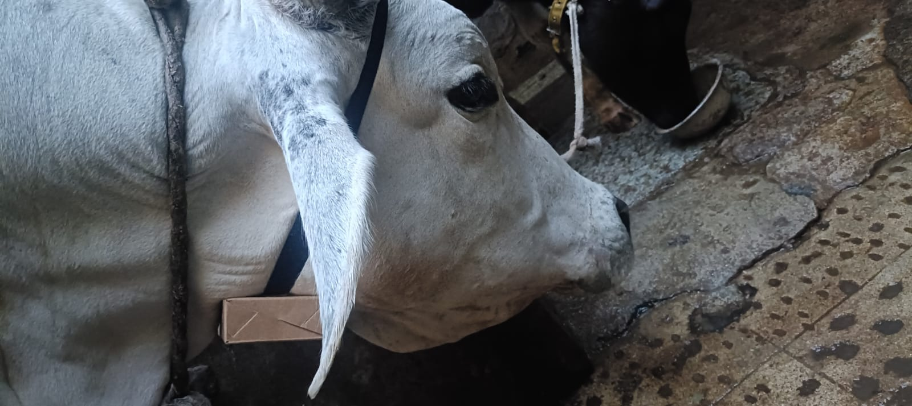

# Experimental Results

## Overview

The developed IoT-based cattle monitoring system was experimentally evaluated under real-world farm conditions. The system successfully acquired jaw movement data, estimated chewing activity, classified rumination behavior, monitored body temperature, and transmitted data to cloud platforms for real-time visualization and long-term logging.

---

# Hardware Prototype

The complete system was implemented using a **perfboard-based hardware prototype** integrating the ESP32-WROOM-32, MPU6050 accelerometer, DS18B20 temperature sensor, and NEO-6M GPS module.

<p align="center">
  
</p>

### Prototype Features

- ESP32-based embedded controller
- Wireless Wi-Fi connectivity
- MPU6050 jaw motion sensing
- DS18B20 temperature monitoring
- GPS-based cattle tracking
- Battery-powered portable operation

---

# Field Deployment

The developed system was deployed on live cattle to evaluate rumination monitoring under actual farm conditions.

<p align="center">
  
</p>

### Sensor Placement

The sensing unit was securely mounted near the mandibular (jaw) region to capture chewing-induced movements while minimizing interference from general body motion.

---

## Live Monitoring and Data Logging

The complete monitoring system was validated by simultaneously observing cattle behavior, the Blynk dashboard, and cloud-based data logging.

<p align="center">
  
</p>

### Experimental Validation

The deployment verified:

- Real-time jaw movement acquisition
- Continuous rumination monitoring
- Wireless data transmission
- Cloud-based data logging
- End-to-end system operation under field conditions

---

# Blynk Dashboard Visualization

The processed sensor data was transmitted to the Blynk IoT platform for remote monitoring and visualization.

<p align="center">
  
</p>

### Dashboard Parameters

The dashboard displays:

- Chews Per Minute (CPM)
- Coefficient of Variation (CV)
- Rumination Status
- Total Chew Count
- Body Temperature
- GPS Location

---

# Experimental Observations

The experimental evaluation demonstrated that the developed system successfully:

- Acquired continuous accelerometer data from jaw movements
- Performed real-time digital signal processing on the ESP32
- Detected chewing events using peak detection
- Estimated chewing frequency (CPM)
- Evaluated chewing regularity using CV
- Classified rumination behavior using embedded firmware
- Monitored body temperature
- Uploaded sensor data to cloud platforms
- Visualized animal activity using the Blynk dashboard
- Successfully operated during live cattle deployment

---

# System Validation

The project validates the integration of embedded sensing, digital signal processing, and IoT technologies for livestock health monitoring.

## Embedded System Validation

- ESP32 firmware implementation
- Multi-sensor integration
- Real-time signal processing
- Embedded rumination classification

## IoT Validation

- Wi-Fi communication
- Cloud telemetry
- Remote dashboard visualization
- Long-term data logging

## Livestock Monitoring Validation

- Jaw movement sensing
- Rumination behavior analysis
- Temperature monitoring
- GPS-based location tracking

---

# Limitations

Current limitations of the prototype include:

- Rule-based rumination classification using fixed thresholds
- GPS accuracy dependent on satellite availability
- Battery life optimization not extensively evaluated
- PCB designed but not fabricated or experimentally validated

---

# Future Improvements

Potential enhancements include:

- Machine Learning-based rumination classification
- Automated health anomaly detection
- Heat stress prediction
- LoRa-based long-range communication
- Solar-powered sensor node
- Fabrication and validation of the custom PCB
- Mobile notification and alert system

---

# Demonstration Media

Additional demonstrations of the project are available in the repository:

```text
/videos/
```

Including:

- Hardware Demonstration
- Live Cattle Deployment
- Dashboard Monitoring
- Cloud Data Logging

---

# Conclusion

The developed IoT-based cattle rumination monitoring system successfully demonstrated real-time jaw movement sensing, rumination classification, temperature monitoring, cloud connectivity, and remote visualization. The successful field deployment validates the feasibility of using low-cost embedded sensing and digital signal processing techniques for precision livestock health monitoring.
