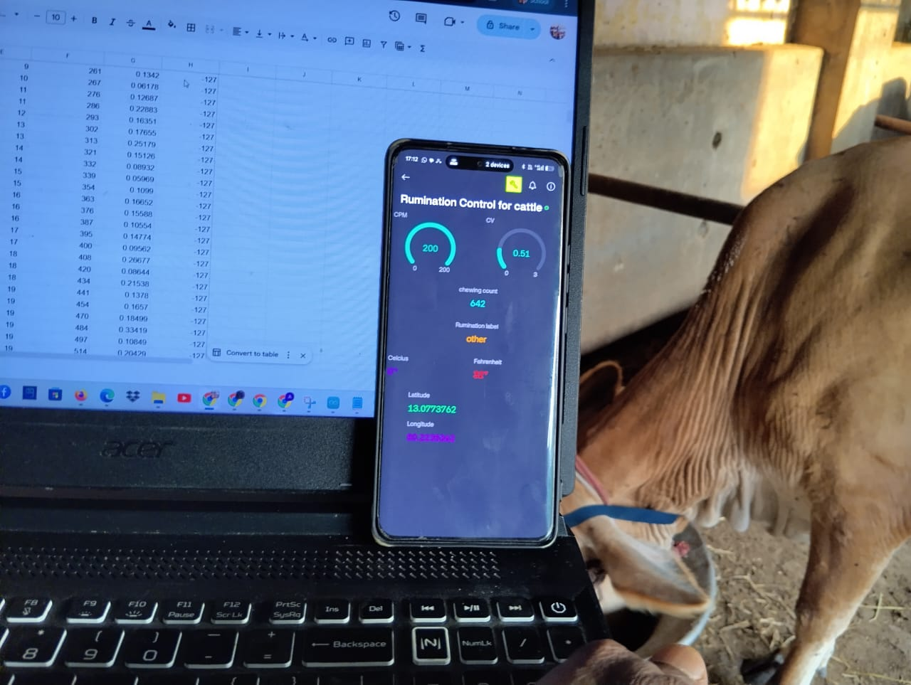
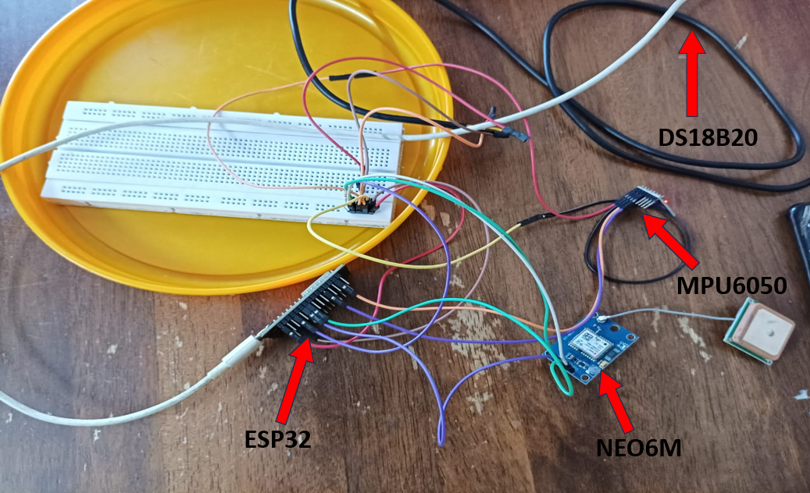
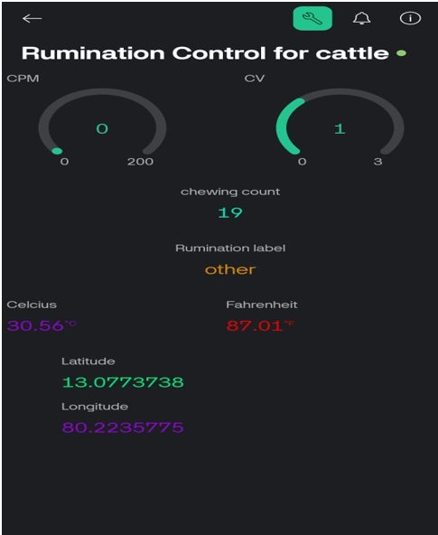

# IoT-Based Cattle Rumination Monitoring and Health Analysis System


<p align="center">
  
</p>

## Project Overview

This project presents an IoT-based cattle monitoring system designed to monitor rumination behavior, body temperature, and cattle location in real time.

The system uses an **ESP32-WROOM-32** microcontroller integrated with an **MPU6050 accelerometer**, **DS18B20 temperature sensor**, and **NEO-6M GPS module**. Accelerometer signals are processed using digital signal processing techniques to estimate chewing activity and classify rumination behavior. The processed data is visualized through a **Blynk IoT dashboard** and logged to **Google Sheets** for long-term monitoring and analysis.

### Applications

- Livestock Health Monitoring
- Precision Livestock Farming
- Behavioral Analytics
- Early Disease Detection
- Heat Stress Monitoring

---

# Key Features

- Real-time rumination monitoring
- Jaw movement sensing using MPU6050
- Signal filtering and peak detection
- Chews Per Minute (CPM) estimation
- Coefficient of Variation (CV) analysis
- Rule-based rumination classification
- Temperature monitoring using DS18B20
- GPS-based cattle tracking
- Blynk IoT dashboard integration
- Google Sheets cloud logging
- Custom PCB design using KiCad
- Field-tested on live cattle

---

# System Workflow

<p align="center">
  
</p>

The firmware continuously acquires accelerometer data, applies digital filtering, detects chewing events, computes behavioral metrics (CPM and CV), classifies rumination activity, and uploads the processed information to cloud platforms for visualization and storage.

---

# Hardware Components

| Component | Purpose |
|------------|----------|
| ESP32-WROOM-32 | Main Controller |
| MPU6050 | Jaw Motion Detection |
| DS18B20 | Temperature Monitoring |
| NEO-6M GPS | Location Tracking |
| 18650 Battery | Portable Power Supply |
| Perfboard Prototype | Hardware Integration |

---

# Hardware Prototype

<p align="center">
  
</p>

The prototype integrates:

- ESP32-WROOM-32
- MPU6050 Accelerometer
- DS18B20 Temperature Sensor
- NEO-6M GPS Module
- Battery Power Supply

---

# IoT Dashboard

<p align="center">
  
</p>

The Blynk dashboard provides real-time visualization of:

- Chews Per Minute (CPM)
- Coefficient of Variation (CV)
- Rumination Status
- Temperature
- Total Chew Count
- GPS Location

---

# Results Summary

The developed system successfully demonstrated:

- Real-time chewing detection
- Rumination behavior classification
- Continuous temperature monitoring
- GPS-based cattle tracking
- Cloud data logging using Google Sheets
- Real-time dashboard visualization
- Successful deployment on live cattle

---

# Repository Structure

```text
ESP32-Cattle-Rumination-Monitoring
│
├── README.md
│
├── docs
│   ├── Methodology.md
│   ├── PCB_Design.md
│   ├── Results.md
│   ├── References.md
│   └── papers/
│       ├── paper_1.pdf
│       ├── paper_2.pdf
│       └── paper_3.pdf
│
├── firmware
│   └── rumination_monitoring.ino
│
├── hardware
│   ├── schematic/
│   ├── pcb_layout/
│   ├── custom_symbols/
│   ├── custom_footprints/
│   └── gerber_files/
│
├── images
│   ├── hardware/
│   ├── deployment/
│   ├── dashboard/
│   ├── workflow/
│   └── pcb/
│
├── videos/
│
├── data/
│
└── LICENSE
```

---

# Documentation

Detailed project documentation is available below:

- 📖 [Methodology](Docs/Methodology.md)
- 🔧 [PCB Design Report](Docs/PCB_Design.md)
- 📊 [Experimental Results](Docs/Results.md)
- 📚 [Research References](Docs/References.md)

---

# Technologies Used

### Hardware

- ESP32-WROOM-32
- MPU6050
- DS18B20
- NEO-6M GPS

### Software

- Arduino IDE
- KiCad
- Blynk IoT
- Google Sheets

### Concepts

- Embedded Systems
- Internet of Things (IoT)
- Digital Signal Processing
- Peak Detection
- Statistical Feature Extraction
- Cloud Telemetry
- PCB Design

---

# Future Enhancements

- Machine Learning-Based Rumination Detection
- Health Anomaly Detection
- Heat Stress Prediction
- LoRa-Based Long-Range Communication
- Solar-Powered Sensor Node
- Custom PCB Fabrication and Miniaturization

---

# Author

**Aniruddhan P**

*M.E. Embedded Systems and Technologies*

**Embedded Systems | Embedded Linux | IoT | Edge AI**